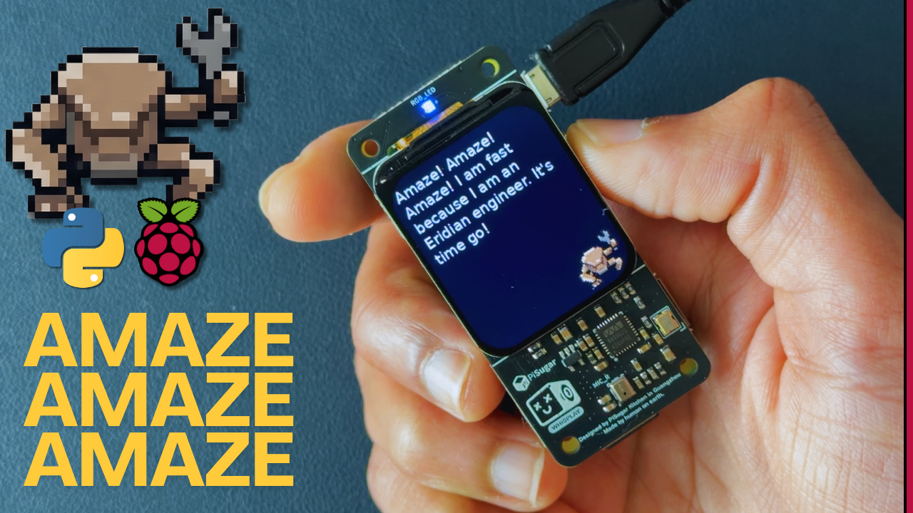

#  Rocky: Your Own Personal Eridanian Buddy

Here is your own alien rock friend inspired by Andy Weir's *Project Hail Mary*. He communicates in musical chords.

This project implements a **Dual-Device "Voice Box & Brain" Architecture** to bring Rocky to life on a Raspberry Pi Zero 2W with near-instant responsiveness.

> [!IMPORTANT]
> **Looking to build your own Rocky?**
> Check out the [**Step-by-Step Installation Guide (BUILD_YOUR_OWN_ROCKY.md)**](BUILD_YOUR_OWN_ROCKY.md)! It covers setting up a fresh Raspberry Pi Zero 2W, installing the PiSugar Whisplay HAT and audio drivers, setting up `uv`, configuring Google Gemini vs Local LM Studio, and running offline Piper TTS voice models.

> [!NOTE]
> **Update (May 17, 2026): Piper TTS Integration!**
> Rocky can now speak with a human voice in parallel with his Eridanian musical chords! This upgrade is completely opt-in, fully configurable via your `.env` file, and allows you to load custom `.onnx` voice models. Check out the new demo video below!

## Demo Videos:

**Full Build Video:**<br>
<a href="https://www.youtube.com/watch?v=NfxFY1LUYDo" target="_blank">
  
</a>

**Piper TTS Feature Demo:**<br>
<a href="https://youtu.be/tMpZ1kpeqoA" target="_blank">
  
</a>

---

## ✨ Core Features

- **Lore-Accurate Eridanian Synthesis**: Generates polyphonic chords in real-time. Specific words map to emotional chords (e.g., "amaze" is a bright E Major), while unknown words are mathematically hashed to permanent, unique 3-frequency signatures.
- **Dual-Brain Architecture**: 
  - **Voice Box (Pi Zero 2W)**: Handles recording, hardware LEDs, LCD display, and Eridanian voice synthesis.
  - **Brain (Mac Hub)**: Uses Apple Silicon-optimized `mlx-whisper` (specifically the `Whisper-Tiny` model) for near-instant STT and **LM Studio** for local LLM inference (Gemma 4).
- **Interactive Visuals**: Custom LCD boot screen (`rocky_boot_screen.png`) and a dynamic "thinking bubble" animation that appears while Rocky is processing.
- **Piper TTS Integration (Opt-in)**: High-quality verbal speech synthesis running in parallel with musical chords. By default, Rocky only speaks in his Eridanian musical chords, but human TTS can be enabled via `.env`. Supports custom fine-tuned models.
- **Sequential Demo Mode**: Advanced demo mode that cycles through a list of phrases from a text file, perfect for presentations or testing without a network connection.
- **Hardware Integration**: Full support for the [**PiSugar Whisplay HAT**](https://github.com/PiSugar/Whisplay) (LCD, Button, RGB LED, and WM8960 Audio).

## 🧠 Architecture Overview

To achieve low-latency AI interactions on a Raspberry Pi Zero 2W, we split the workload:
1.  **The Pi** records audio and `POST`s the raw bytes to the Mac Hub.
2.  **The Mac Hub** intercepts the audio, transcribes it instantly using `mlx-whisper` (`Whisper-Tiny`) and pings **LM Studio**.
3.  **LM Studio** generates the Rocky-persona response.
4.  **The Pi** receives the text, renders the response on the LCD, and synthesizes the Eridanian chords.

## 📈 Benchmarking (Local M2 Mac 8GB vs Cloud)

| Interaction Phase | Local (STT `Whisper-Tiny` + `gemma-4-e2b`) | Cloud (Gemini API `gemini-2.5-flash-lite`) |
| :--- | :--- | :--- |
| Handshake & Transcribe | ~0.8s | ~1.2s |
| LLM Reasoning & Response | ~1.2s | ~0.8s |
| **Total Latency** | **~2.0s** | **~2.0s** |

*Note: The Local setup matches Cloud speeds while running entirely offline/privately on your local network.*

## 🥧 Raspberry Pi Setup (The Voice Box)

> [!TIP]
> For a detailed, comprehensive walkthrough, read the [**Step-by-Step Hardware & Software Setup Guide (BUILD_YOUR_OWN_ROCKY.md)**](BUILD_YOUR_OWN_ROCKY.md).

### Option A: The "It Just Works" Way (System Python)
Skip virtual environments and use pre-compiled hardware drivers:
```bash
sudo apt-get update
sudo apt-get install python3-pygame python3-spidev python3-pil python3-lgpio
SDL_AUDIODRIVER=alsa python3 rocky.py
```

### Option B: The Isolated Way (uv)
```bash
# Install build headers
sudo apt-get install libsdl2-2.0-0 libsdl2-mixer-2.0-0 python3-dev libgpiod-dev liblgpio-dev swig
uv sync
uv run rocky.py
```

## 🖥️ Mac Hub Setup (The Brain)

1.  **Start LM Studio**: Load a 4-bit quantized model (e.g., `Gemma 4-e2b-it-GGUF`) and start the **Local Server** on port `1234`.
2.  **Run STT Proxy**:
    ```bash
    uv sync --extra mac-server
    uv run stt_server.py
    ```

## ⚙️ Configuration (.env)

| Variable | Description | Default |
| :--- | :--- | :--- |
| `GEMINI_API_KEY` | Your Google AI Studio API Key (for Cloud mode). | None |
| `USE_LOCAL_LLM` | Set to `True` to use the Mac STT Server. | `False` |
| `LM_STUDIO_URL` | The endpoint for your local LM Studio instance. | `http://localhost:1234/v1` |
| `SHOW_BOOT_SCREEN` | Show Rocky's splash screen on startup. | `True` |
| `USE_PIPER` | Enable Piper TTS for verbal speech. | `False` |
| `PIPER_MODEL` | Piper voice model file (e.g. `en_US-lessac-low.onnx`). | `en_US-lessac-low.onnx` |
| `PIPER_RATE` | Sample rate matching the Piper model. | `16000` |
| `DEMO_MODE` | Bypass LLM and use pre-defined responses. | `False` |
| `DEMO_FILE` | Path to text file for sequential demo phrases. | `demo_phrases.txt` |

## 🔬 Experimental Lab
- **Show & Speak**: Test TTS and LCD visuals. Supports loading specific model epochs:
  ```bash
  # Load 'rocky' voice with specific epoch checkpoint (e.g. 2607)
  python lab/show_and_speak.py rocky 2607
  ```
- **Astromech Test**: R2-D2 style sound generator (`uv run r2d2`).
- **Gemma Model**: The original 10GB unquantized inference server (`uv run rocky-server`).

## 📜 License
MIT License. Feel free to build your own Eridanian friend!
